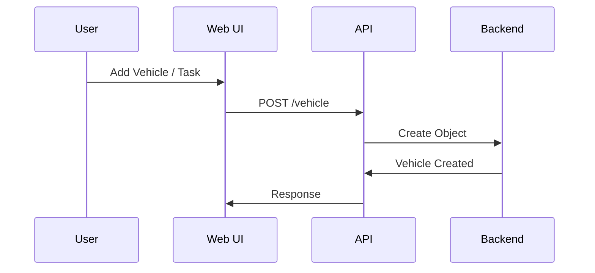

🚗 Automobile Maintenance Library

A modern C++ library for managing vehicle maintenance tasks, featuring a sleek Bootstrap-powered web interface. Tracks electric, gas, and diesel vehicles with task compatibility logic, real-time stats, and RESTful communication between frontend and backend.

---

 📐 System Architecture

 🔧 Backend (C++17)

 Build System: CMake (v3.16+)
 Concurrency: POSIX Threads (Pthread)
 Design: Object-Oriented Inheritance Hierarchy
 Compiler: GCC/Clang with `-O2` optimizations

 🖥 Frontend (Bootstrap + JS)

 UI Framework: Bootstrap 5.3.0
 Icons: Font Awesome 6.4.0
 Pattern: Modular, class-based Vanilla JS
 Communication: RESTful API with backend

---

 🧩 Key Components

 🧱 C++ Classes

 `Automobile` (Base Class): `make`, `model`, `year`, `odometerReading`
 `ElectricCar` / `GasCar` / `DieselCar`: Inherit from `Automobile`
 `MaintenanceTask`: Task name, description, vehicle compatibility
 `MaintenanceLibrary`: CRUD for vehicles/tasks, validation logic

 🌐 Frontend Modules

 `AutomobileMaintenanceApp`: Main controller
 Dashboard UI: Live stats, vehicle management
 Task Modal: Add/edit tasks with validation & toasts

---

 🔁 Data Flow



 🚘 Vehicle Management: Input validated, object stored in backend.
 🔧 Task Assignment: Tasks filtered by vehicle type, validated and linked.
 💾 Data Persistence: In-memory with RESTful access.

---

 🔧 Build & Run

 🛠 Prerequisites

 C++17 Compiler (GCC/Clang/MinGW)
 CMake 3.16+
 PkgConfig, Pthread

 ⚙️ Build (Linux / macOS)

```bash
mkdir build && cd build
cmake ..
make
./maintenance_server.exe
```

 🪟 Build (Windows)

```bash
build_windows.bat
```

---

 🚀 Deployment Strategy

 Static asset serving via built-in server
 Lightweight API server
 Windows and Linux compatibility
 Optimized with `-O2` flag for performance

---

 🧪 Testing (Optional)

 Google Test (commented in CMakeLists.txt)

```bash
cmake -DENABLE_TESTS=ON ..
make
./runTests
```

---

 📈 Features at a Glance

 ✅ Cross-platform builds
 ✅ Clean UI with responsive design
 ✅ RESTful communication
 ✅ Maintenance validation logic
 ✅ Real-time statistics
 ✅ Bootstrap modals & toasts
 ✅ Modular & extendable design

---

 📌 Recent Updates

 ✅ Windows Compatibility Fixed
 ✅ Automatic CMake generator selection
 ✅ Winsock2 support added
 ✅ Socket read/write now cross-platform


---

 🤝 Contributing

Pull requests are welcome! For major changes, please open an issue first.
Ensure that your code is tested and follows the coding guidelines.

---

 📜 License

This project is licensed under the [MIT License](LICENSE).
